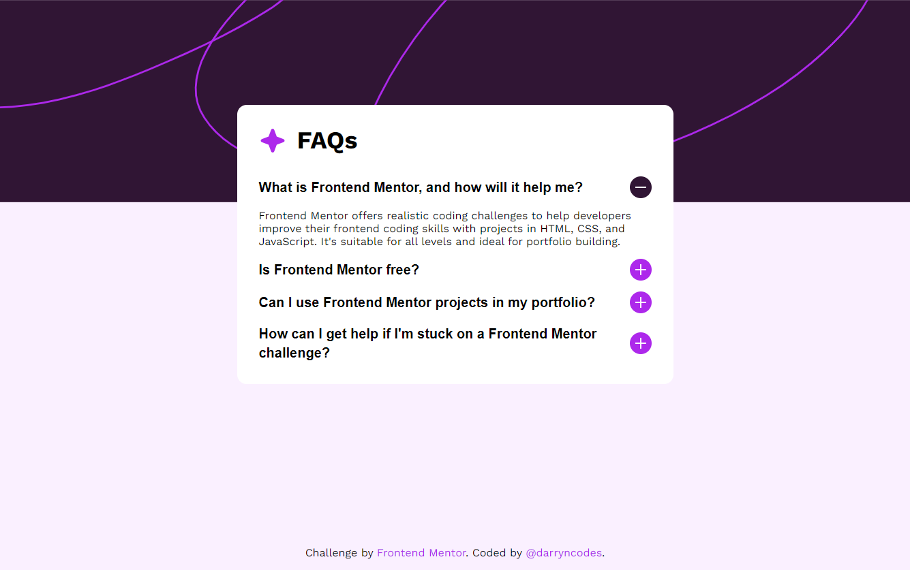
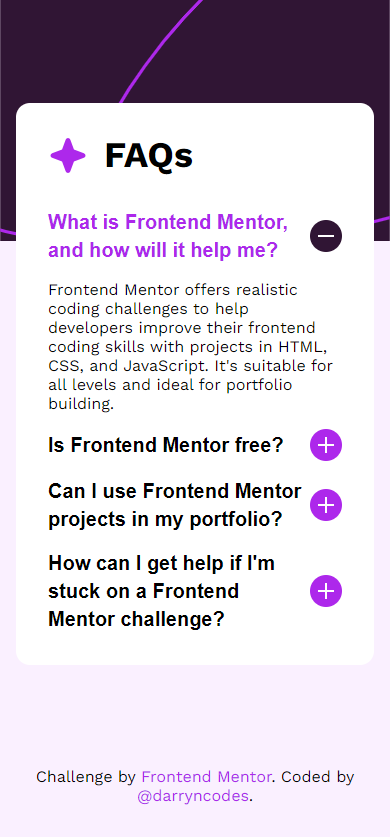

# Frontend Mentor - FAQ accordion solution

This is a solution to the [FAQ accordion challenge on Frontend Mentor](https://www.frontendmentor.io/challenges/faq-accordion-wyfFdeBwBz). Frontend Mentor challenges help you improve your coding skills by building realistic projects.

## Table of contents

-   [Overview](#overview)
    -   [The challenge](#the-challenge)
    -   [Screenshot](#screenshot)
    -   [Links](#links)
-   [My process](#my-process)
    -   [Built with](#built-with)
    -   [What I learned](#what-i-learned)
    -   [Useful resources](#useful-resources)
-   [Author](#author)

## Overview

### The challenge

Users should be able to:

-   Hide/Show the answer to a question when the question is clicked
-   Navigate the questions and hide/show answers using keyboard navigation alone
-   View the optimal layout for the interface depending on their device's screen size
-   See hover and focus states for all interactive elements on the page

### Screenshot





### Links

-   Solution URL: [Add solution URL here](https://your-solution-url.com)
-   Live Site URL: [Add live site URL here](https://your-live-site-url.com)

## My process

### Built with

-   Semantic HTML5 markup
-   CSS custom properties
-   Flexbox
-   CSS Grid
-   Mobile-first workflow
-   JavaScript

### What I learned

Use this section to recap over some of your major learnings while working through this project. Writing these out and providing code samples of areas you want to highlight is a great way to reinforce your own knowledge.

To see how you can add code snippets, see below:

```html
<h1>Some HTML code I'm proud of</h1>
```

```css
.proud-of-this-css {
    color: papayawhip;
}
```

```js
const proudOfThisFunc = () => {
    console.log('🎉');
};
```

If you want more help with writing markdown, we'd recommend checking out [The Markdown Guide](https://www.markdownguide.org/) to learn more.

**Note: Delete this note and the content within this section and replace with your own learnings.**

### Useful resources

-   [Use this instead of :focus in your css](https://www.youtube.com/shorts/FHgnhnUwwQM) - This helps to have your focus styles when navigating by keyboard but not when clicking with a mouse.
-   [Creating Accessible Accordions with HTML, CSS & JavaScript](https://dev.to/lizlaffitte/creating-an-accordion-with-html-css-javascript-3gmn) - Showing and hiding content is a common design pattern, using the right html attributes to help describe what's going on to screen readers is essential for inclusive user interfaces. I learnt about: `aria-expanded`, `aria-hidden`, `aria-controls`.

## Author

-   Website - [darryn.dev](https://darryn.dev)
-   Frontend Mentor - [@darryncodes](https://www.frontendmentor.io/profile/darryncodes)
-   Twitter - [@darryncodes](https://twitter.com/darryncodes)
